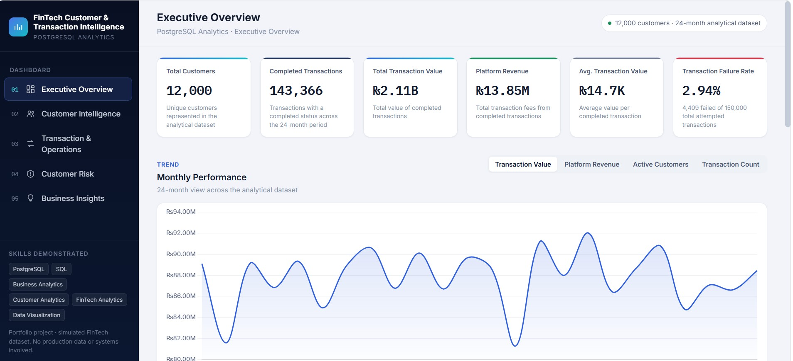
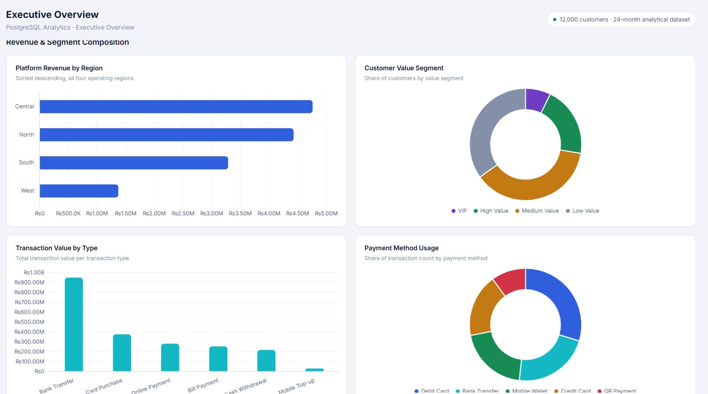
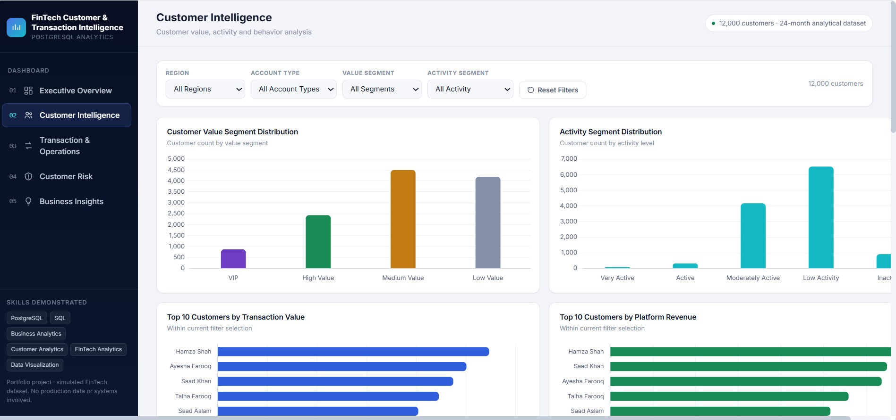
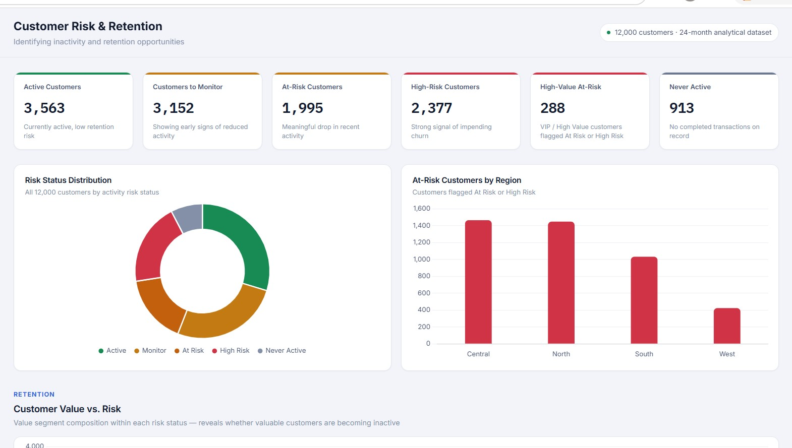
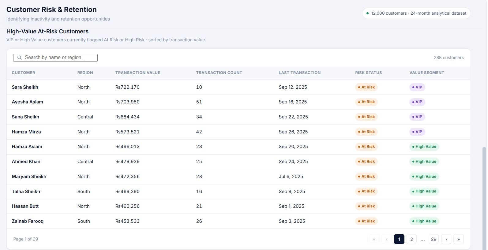
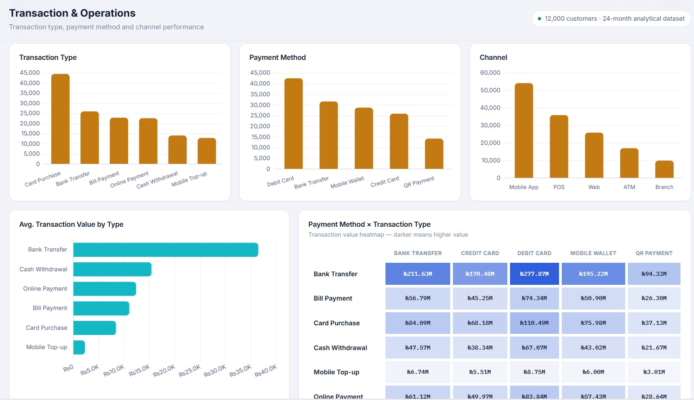
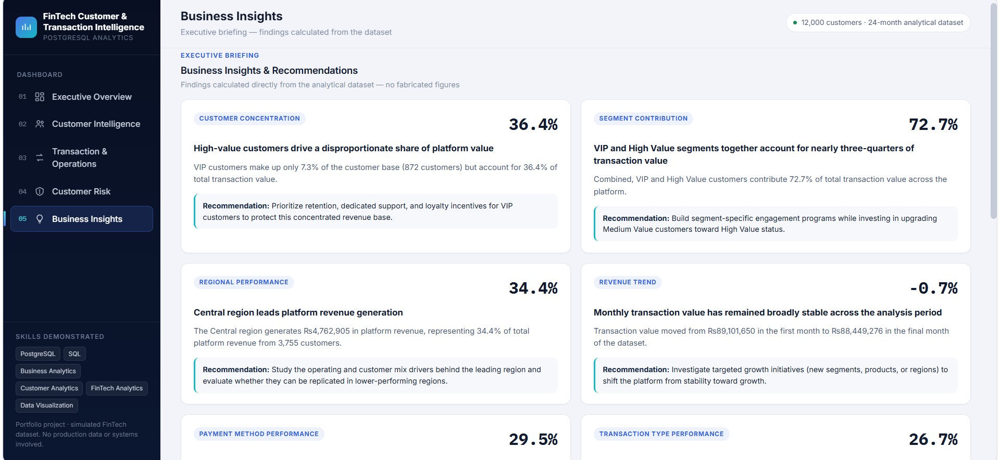

# 💳 FinTech Customer & Transaction Intelligence

[](https://salar13684-lgtm.github.io/fintech-customer-transaction-intelligence/)

[](https://www.postgresql.org/)
[](#)
[](#)
[](#)

## 📊 Project Overview

**FinTech Customer & Transaction Intelligence** is an end-to-end PostgreSQL analytics and business intelligence portfolio project focused on customer value, transaction behavior, regional performance, revenue generation, customer activity, retention risk, transaction operations, and executive-level business insights.

The project starts with customer and transaction data, applies structured SQL analytics in PostgreSQL, produces analytical datasets for dashboarding, and presents the results through an interactive HTML dashboard.

The SQL project explicitly defines its scope as **SQL analytics only — no database engineering**. Business KPIs use completed transactions unless otherwise stated.

> **Project type:** FinTech Analytics · Business Analytics · Customer Analytics · Transaction Analytics · Business Intelligence

## 🚀 Live Interactive Dashboard

### [👉 Launch the Live Dashboard](https://salar13684-lgtm.github.io/fintech-customer-transaction-intelligence/)

The dashboard contains five analytical areas:

1. **Executive Overview**
2. **Customer Intelligence**
3. **Transaction & Operations**
4. **Customer Risk & Retention**
5. **Business Insights & Recommendations**

The dashboard is built from supplied analytical CSV exports and is presented as a portfolio project using a simulated FinTech dataset.

---

## 🎯 Business Objectives

The project is designed to answer practical business questions including:

- How many customers and completed transactions are represented?
- What is the total transaction value and platform revenue?
- Which regions generate the most transaction value and revenue?
- Which transaction types and payment methods drive performance?
- Which customers generate the highest transaction value and platform revenue?
- How can customers be segmented by transaction value?
- How does transaction performance change over the 24-month period?
- Which customers show reduced activity or retention risk?
- Which high-value customers are currently at risk?
- What transaction failures and reversals exist?
- What business actions can be recommended from the analysis?

---

## 📌 Executive KPI Snapshot

The dashboard's analytical dataset contains:

| KPI | Value |
|---|---:|
| Total Customers | **12,000** |
| Completed Transactions | **143,366** |
| Total Completed Transaction Value | **₨2,107,685,759.69** |
| Platform Revenue | **₨13,852,639.75** |
| Average Completed Transaction Value | **₨14,701.43** |
| Total Recorded Transaction Attempts | **150,000** |
| Failed Transactions | **4,409** |
| Reversed Transactions | **2,225** |
| Transaction Failure Rate | **2.94%** |
| Analytical Period | **24 months** |

---

# 🔄 Analytical Workflow

```text
Source Customer & Transaction Data
              │
              ▼
      PostgreSQL Data Setup
              │
              ▼
       Data Exploration
              │
              ▼
       Customer Analytics
              │
              ▼
     Transaction & Revenue
            Analysis
              │
              ▼
      Monthly / Time-Series
            Analysis
              │
              ▼
     Customer Segmentation
              │
              ▼
     Customer Activity &
       Retention Risk
              │
              ▼
     Business Insight Outputs
              │
              ▼
      Dashboard-Ready Data
              │
              ▼
    Interactive BI Dashboard
```

---

# 🛠️ Technologies & Skills

### Database & SQL
- PostgreSQL
- SQL
- SELECT / WHERE / ORDER BY
- GROUP BY / HAVING
- INNER JOIN / LEFT JOIN
- CASE expressions
- CTEs
- Subqueries
- EXISTS / NOT EXISTS
- Window functions
- RANK / DENSE_RANK
- LAG
- DATE_TRUNC
- COALESCE
- NULLIF
- CAST
- Aggregations
- KPI calculations

### Analytics
- Customer Analytics
- Transaction Analytics
- Revenue Analytics
- Regional Analysis
- Customer Segmentation
- Customer Ranking
- Time-Series Analysis
- Activity / Inactivity Analysis
- Risk & Retention Analysis
- Transaction Failure Analysis
- Business KPI Analysis
- Business Insight Generation

### Dashboard
- HTML
- CSS
- JavaScript
- Chart.js
- Interactive filters
- KPI cards
- Tables
- Pagination
- Search and sorting
- Bar charts
- Line charts
- Doughnut charts
- Scatter plots
- Heatmaps
- Executive reporting

---

# 🧩 SQL Analysis Coverage

The SQL analysis is organized into **15 analytical sections containing 40 documented analytical queries**.

| Section | Analysis |
|---|---|
| 01 | Basic Exploration |
| 02 | Customer Analytics |
| 03 | Transaction Analytics |
| 04 | Top Customers |
| 05 | Customer Segmentation with CASE |
| 06 | Regional Performance |
| 07 | Monthly Trends |
| 08 | Customer Ranking |
| 09 | Window Functions by Region |
| 10 | Customer Activity / Inactivity |
| 11 | Subqueries |
| 12 | HAVING / Business Filters |
| 13 | Self Join |
| 14 | NULL / COALESCE / NULLIF / CAST |
| 15 | Business Insight Outputs |

The complete query-by-query explanation is available in [`docs/03-sql-analysis.md`](docs/03-sql-analysis.md).

---

# 👥 Customer Analytics

Customers are analyzed across:

- Region
- Account type
- Account status
- Transaction count
- Transaction value
- Platform revenue
- Average transaction value
- Value segment
- Activity segment
- Risk status
- Last transaction date

### Customer Value Segments

The SQL analysis defines:

| Segment | Spending Threshold |
|---|---:|
| VIP | ≥ ₨500,000 |
| High Value | ≥ ₨200,000 |
| Medium Value | ≥ ₨50,000 |
| Low Value | < ₨50,000 |

Dashboard distribution:

- **VIP:** 872
- **High Value:** 2,435
- **Medium Value:** 4,505
- **Low Value:** 4,188

---

# 💳 Transaction & Revenue Analytics

Completed transactions are used for the core business KPIs.

The analysis covers:

- Transaction count
- Transaction value
- Platform revenue
- Average transaction value
- Transaction type
- Payment method
- Channel
- Regional performance
- Monthly performance
- Transaction failure rate
- Reversed transactions

### Transaction Types

The dashboard analyzes:

- Bank Transfer
- Card Purchase
- Online Payment
- Bill Payment
- Cash Withdrawal
- Mobile Top-up

### Payment Methods

The dashboard analyzes:

- Debit Card
- Bank Transfer
- Mobile Wallet
- Credit Card
- QR Payment

### Channels

The dashboard analyzes:

- Mobile App
- POS
- Web
- ATM
- Branch

---

# 📈 Time-Series Analysis

The project contains a 24-month analytical period from **January 2024 through December 2025**.

Monthly analysis includes:

- Transaction count
- Active customers
- Transaction value
- Platform revenue
- Average transaction value
- Revenue change using `LAG`
- Cumulative revenue
- Average monthly revenue

The dashboard also allows the executive overview trend chart to switch between:

- Transaction Value
- Platform Revenue
- Active Customers
- Transaction Count

---

# ⚠️ Customer Risk & Retention

Customer activity is analyzed using the customer's most recent completed transaction.

The SQL analysis explicitly uses **December 31, 2025** as the reference date for the 90-day inactivity analysis.

Dashboard risk categories:

- Active
- Monitor
- At Risk
- High Risk
- Never Active

Dashboard risk distribution:

| Risk Status | Customers |
|---|---:|
| Active | 3,563 |
| Monitor | 3,152 |
| At Risk | 1,995 |
| High Risk | 2,377 |
| Never Active | 913 |

The dashboard identifies **288 high-value customers** as At Risk or High Risk.

---

# 💡 Key Business Insights

The dashboard's business-insight layer contains findings calculated from the analytical dataset.

### 1. High-value customers drive a disproportionate share of platform value

VIP customers represent **7.3% of the customer base** but account for **36.4% of total transaction value**.

**Recommendation:** Prioritize VIP retention, dedicated support, and loyalty incentives.

### 2. VIP + High Value segments contribute 72.7% of transaction value

The two highest customer-value segments together contribute **72.7% of total transaction value**.

**Recommendation:** Protect high-value customers while developing programs to move Medium Value customers upward.

### 3. Central leads platform revenue

Central generates approximately **₨4,762,905** in platform revenue, representing **34.4%** of total platform revenue.

**Recommendation:** Investigate the customer and operating mix behind Central's performance and evaluate whether successful practices can be replicated elsewhere.

### 4. Monthly transaction value is broadly stable

Transaction value moved from approximately **₨89.10M** in the first month to **₨88.45M** in the final month, a change of approximately **-0.7%**.

**Recommendation:** Introduce targeted growth initiatives across segments, products, or regions.

### 5. Debit Card is the leading payment method by transaction value

Debit Card represents **29.5%** of total transaction value.

**Recommendation:** Maintain reliability and cost efficiency for the leading payment method while continuing to support alternative methods.

### 6. Bank Transfer is the leading transaction type by platform revenue

Bank Transfer contributes **26.7%** of total platform revenue.

**Recommendation:** Protect the performance of the leading revenue driver while exploring growth in adjacent transaction types.

### 7. Customer retention is a significant business consideration

The dashboard identifies **4,372 customers (36.4%)** in the At Risk or High Risk categories. These customers represent **14.5% of total transaction value**, and **288** are VIP or High Value.

**Recommendation:** Launch targeted re-engagement efforts, prioritizing high-value customers first.

### 8. Transaction failures are measurable

Out of **150,000** recorded transaction attempts:

- **4,409 failed**
- **2,225 were reversed**
- Failure rate = **2.94%**

**Recommendation:** Capture transaction status together with payment-method and transaction-type dimensions in future data collection to enable root-cause failure analysis.

---

# 📊 Interactive Dashboard Features

## Executive Overview

Provides:

- Six executive KPIs
- 24-month performance trend
- Transaction value trend
- Platform revenue trend
- Active customer trend
- Transaction count trend
- Revenue by region
- Customer value segment distribution
- Transaction value by type
- Payment method usage

## Customer Intelligence

Provides:

- Region filtering
- Account type filtering
- Value segment filtering
- Activity segment filtering
- Customer value distribution
- Activity distribution
- Top 10 customers by transaction value
- Top 10 customers by platform revenue
- Customer value vs. transaction frequency scatter plot
- Value-weighted average transaction value by segment
- Searchable customer table
- Sortable columns
- Pagination

## Transaction & Operations

Provides:

- Transaction type filtering
- Payment method filtering
- Channel filtering
- Monthly transaction count
- Monthly transaction value
- Category performance by count/value/revenue
- Average transaction value by type
- Payment method × transaction type heatmap
- Failure KPIs

## Customer Risk

Provides:

- Risk status distribution
- At-risk customers by region
- Customer value vs. risk
- High-value at-risk customer table
- Search
- Sorting
- Pagination

## Business Insights

Provides:

- Insight category
- Key metric
- Explanation
- Business implication
- Recommendation
- Methodology and assumptions

---

# 🖼️ Dashboard Screenshots

Place the following screenshots in the repository's `screenshots/` folder:

### 01 — Executive Overview


### 02 — Revenue & Segment Analysis


### 03 — Customer Intelligence


### 04 — Customer Risk & Retention


### 05 — High-Value & At-Risk Customers


### 06 — FinTech Transaction Intelligence


### 07 — Business Insights & Recommendations


---

# 📁 Repository Structure

```text
fintech-customer-transaction-intelligence/
│
├── .github/
│   └── workflows/
│       └── deploy-dashboard.yml
│
├── dashboard-data/
│   ├── dashboard.html
│   ├── customer_overview.csv
│   ├── customer_risk.csv
│   ├── monthly_performance.csv
│   ├── regional_performance.csv
│   ├── transaction status performance.csv
│   └── transaction_performance.csv
│
├── screenshots/
│   ├── 01-executive-overview-customer-transaction-analytics.jpg
│   ├── 02-revenue-segment-analysis-fintech.jpg
│   ├── 03-customer-intelligence-analysis.jpg
│   ├── 04-customer-risk-retention-analysis.jpg
│   ├── 05-high-value-at-risk-customers.jpg
│   ├── 06-fintech-transaction-intelligence-dashboard.jpg
│   └── 07-business-insights-recommendations.jpg
│
├── source-raw-data/
│   ├── customers.csv
│   └── transactions.csv
│
├── sql-analysis/
│   ├── 01_schema_and_setup.sql
│   ├── 02_data_exploration_and_quality.sql
│   ├── 03_customer_analytics.sql
│   ├── 04_transaction_and_revenue_analysis.sql
│   ├── 05_time_series_analysis.sql
│   ├── 06_customer_risk_and_retention.sql
│   ├── 07_business_insights.sql
│   └── 08_dashboard_analysis.sql
│
├── LICENSE
└── README.md
```

---

# 🔍 Data & Methodology Notes

- The dataset is **simulated** and is not production financial data.
- The SQL project is explicitly scoped to **SQL analytics**, not database engineering.
- Core business KPIs use **completed transactions** unless otherwise stated.
- The dashboard contains **12,000 customers** and a **24-month analytical period**.
- 913 customers have no completed transactions and are classified as **Never Active**.
- Failure rate is calculated against all recorded transaction attempts: completed, failed, and reversed.
- Failure-rate analysis cannot be broken down by payment method or transaction type because transaction status is not available at those dimensions in the analytical dataset.
- Segment average transaction value is calculated using a **value-weighted method**: total transaction value divided by total transaction count.
- Dashboard totals were cross-checked across regional, monthly, transaction-type, and customer-level outputs and reconcile to **₨2,107,685,759.69** total completed transaction value.

---

# 👨‍💼 Recruiter-Relevant Skills Demonstrated

This project demonstrates practical ability in:

- PostgreSQL
- SQL analytics
- Data exploration
- Relational joins
- CTEs
- Subqueries
- Window functions
- Business KPI development
- Customer segmentation
- Customer ranking
- Revenue analysis
- Time-series analysis
- Regional performance analysis
- Risk and retention analysis
- Transaction operations analysis
- Business insight generation
- Interactive dashboard design
- Data visualization
- Executive reporting
- Analytical storytelling

---

# 📂 Project Resources

| Folder / File | Purpose |
|---|---|
| `source-raw-data/` | Original customer and transaction data |
| `sql-analysis/` | PostgreSQL analytical workflow |
| `dashboard-data/` | Dashboard-ready analytical data and interactive dashboard |
| `screenshots/` | Dashboard presentation images |
| `README.md` | Project documentation |

---

# 🚀 How to Explore the Project

### 1. View the dashboard

**[Launch the Live Dashboard](https://salar13684-lgtm.github.io/fintech-customer-transaction-intelligence/)**

### 2. Review the SQL

Open the `sql-analysis/` folder and follow the numbered analytical workflow.

### 3. Review the source data

Open `source-raw-data/` to inspect the customer and transaction datasets.

### 4. Review the analytical outputs

Open `dashboard-data/` to inspect the datasets used by the dashboard.

### 5. Review the dashboard visuals

Open `screenshots/` to see the dashboard pages and business-insight views.

---

**Muhammad Salar Shah**

BS Financial Technology Student

Data Analytics | Business Analytics | SQL | Python | Power BI | Aspiring Credit Risk & Fraud Analytics
 
---

## 🤝 Connect With Me

### LinkedIn

www.linkedin.com/in/salar-shah-7bb2683a2

### GitHub

https://github.com/salar13684-lgtm

### Portfolio

https://salar-shah-portfolio.vercel.app

---

## ⭐ Support

If you found this project useful, consider giving it a ⭐ on GitHub.

It helps support my work and encourages me to build more Business Analytics projects.

---
# 📜 License
This project is licensed under the MIT License.
